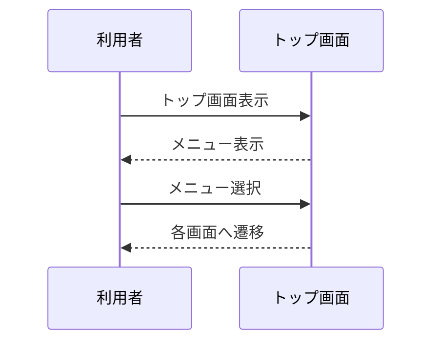
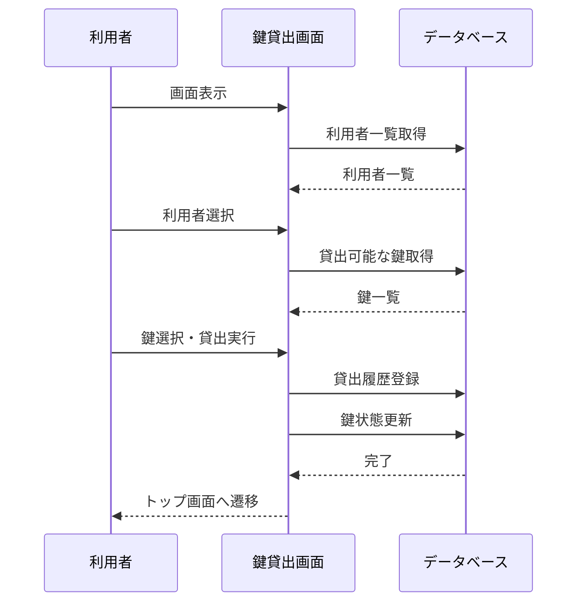
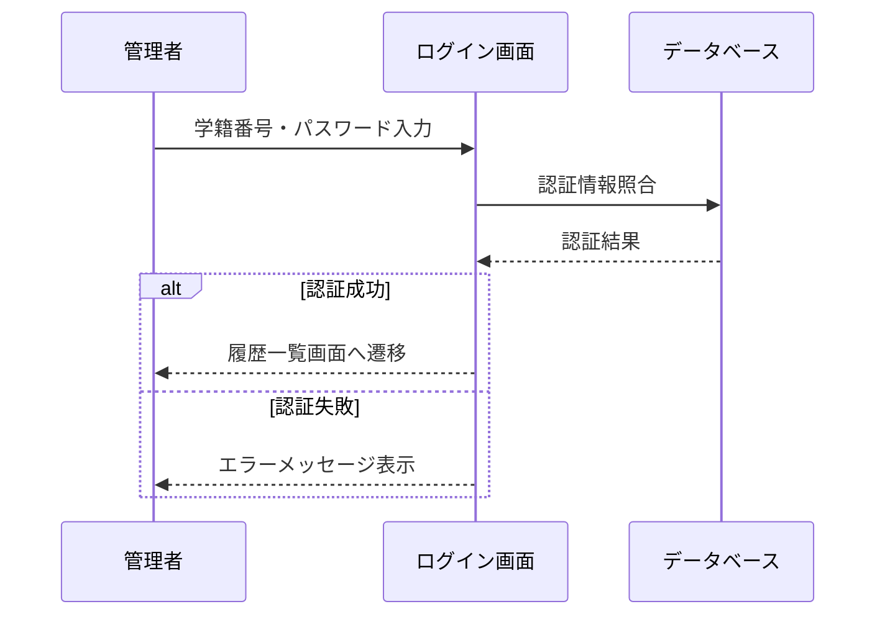
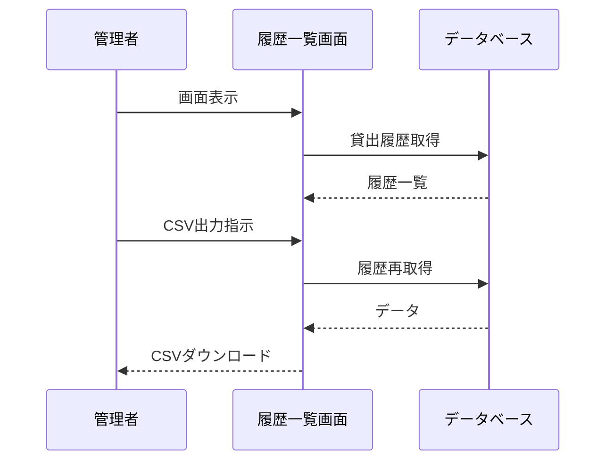
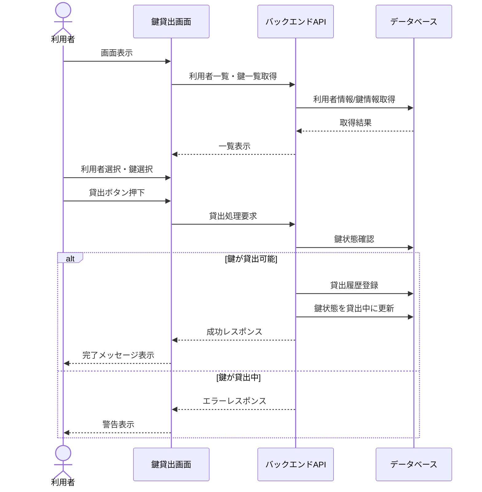
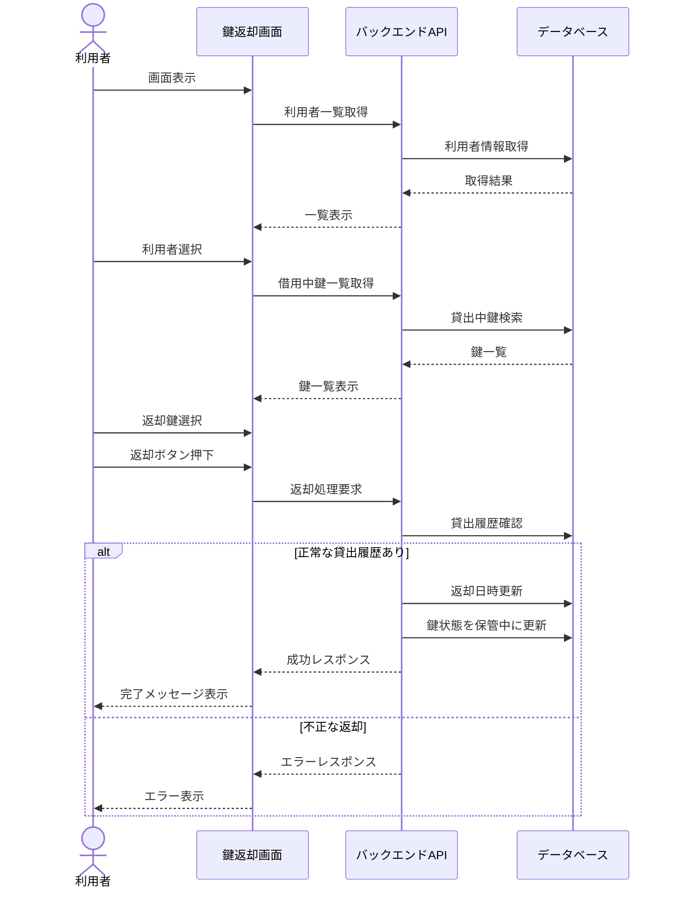

## シーケンス図

### S-1 トップ画面

```mermaid
sequenceDiagram
    participant U as 利用者
    participant T as トップ画面

    U->>T: トップ画面表示
    T-->>U: メニュー表示
    U->>T: メニュー選択
    T-->>U: 各画面へ遷移
```

### S-2 鍵貸出画面

```mermaid
sequenceDiagram
    participant U as 利用者
    participant S as 鍵貸出画面
    participant DB as データベース

    U->>S: 画面表示
    S->>DB: 利用者一覧取得
    DB-->>S: 利用者一覧
    U->>S: 利用者選択
    S->>DB: 貸出可能な鍵取得
    DB-->>S: 鍵一覧
    U->>S: 鍵選択・貸出実行
    S->>DB: 貸出履歴登録
    S->>DB: 鍵状態更新
    DB-->>S: 完了
    S-->>U: トップ画面へ遷移
```

### S-3 鍵返却画面

```mermaid
sequenceDiagram
    participant U as 利用者
    participant S as 鍵返却画面
    participant DB as データベース

    U->>S: 画面表示
    S->>DB: 利用者一覧取得
    DB-->>S: 利用者一覧
    U->>S: 利用者選択
    S->>DB: 貸出中の鍵取得
    DB-->>S: 鍵一覧
    U->>S: 鍵選択・返却実行
    S->>DB: 返却日時更新
    S->>DB: 鍵状態更新
    DB-->>S: 完了
    S-->>U: トップ画面へ遷移
```

### S-4 管理者ログイン画面

```mermaid
sequenceDiagram
    participant A as 管理者
    participant L as ログイン画面
    participant DB as データベース

    A->>L: 学籍番号・パスワード入力
    L->>DB: 認証情報照合
    DB-->>L: 認証結果
    alt 認証成功
        L-->>A: 履歴一覧画面へ遷移
    else 認証失敗
        L-->>A: エラーメッセージ表示
    end
```

### S-5 履歴一覧画面

```mermaid
sequenceDiagram
    participant A as 管理者
    participant H as 履歴一覧画面
    participant DB as データベース

    A->>H: 画面表示
    H->>DB: 貸出履歴取得
    DB-->>H: 履歴一覧
    A->>H: CSV出力指示
    H->>DB: 履歴再取得
    DB-->>H: データ
    H-->>A: CSVダウンロード
```

### S-2 鍵貸出処理 シーケンス図

```mermaid
sequenceDiagram
    actor 利用者
    participant UI as 鍵貸出画面
    participant API as バックエンドAPI
    participant DB as データベース

    利用者->>UI: 画面表示
    UI->>API: 利用者一覧・鍵一覧取得
    API->>DB: 利用者情報/鍵情報取得
    DB-->>API: 取得結果
    API-->>UI: 一覧表示

    利用者->>UI: 利用者選択・鍵選択
    利用者->>UI: 貸出ボタン押下
    UI->>API: 貸出処理要求

    API->>DB: 鍵状態確認
    alt 鍵が貸出可能
        API->>DB: 貸出履歴登録
        API->>DB: 鍵状態を貸出中に更新
        API-->>UI: 成功レスポンス
        UI-->>利用者: 完了メッセージ表示
    else 鍵が貸出中
        API-->>UI: エラーレスポンス
        UI-->>利用者: 警告表示
    end
```

---

### S-3 鍵返却処理 シーケンス図

```mermaid
sequenceDiagram
    actor 利用者
    participant UI as 鍵返却画面
    participant API as バックエンドAPI
    participant DB as データベース

    利用者->>UI: 画面表示
    UI->>API: 利用者一覧取得
    API->>DB: 利用者情報取得
    DB-->>API: 取得結果
    API-->>UI: 一覧表示

    利用者->>UI: 利用者選択
    UI->>API: 借用中鍵一覧取得
    API->>DB: 貸出中鍵検索
    DB-->>API: 鍵一覧
    API-->>UI: 鍵一覧表示

    利用者->>UI: 返却鍵選択
    利用者->>UI: 返却ボタン押下
    UI->>API: 返却処理要求

    API->>DB: 貸出履歴確認
    alt 正常な貸出履歴あり
        API->>DB: 返却日時更新
        API->>DB: 鍵状態を保管中に更新
        API-->>UI: 成功レスポンス
        UI-->>利用者: 完了メッセージ表示
    else 不正な返却
        API-->>UI: エラーレスポンス
        UI-->>利用者: エラー表示
    end
```
